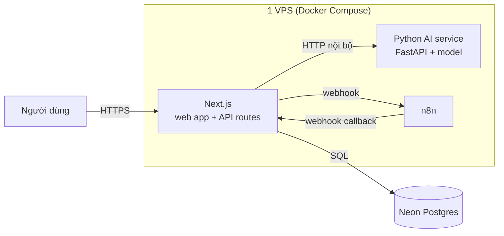

# Quyết định stack — ANSER Auto

Vì sao mảng dịch vụ sửa chữa ô tô dùng đúng stack của ANSER Web v2, và hướng đi cho hai phần
sẽ tách rời: AI và n8n.

## 1. Quyết định

```
Web app (UI + backend logic)  →  Next.js fullstack (1 project, Route Handlers)
AI (chẩn đoán / OCR / dự báo)  →  Service Python riêng, gọi qua HTTP
n8n (automation)               →  Service riêng (self-host), gọi qua webhook
Dữ liệu                        →  Neon Postgres + Drizzle ORM
```

## 2. Vì sao giữ nguyên stack của ANSER v2

Đây là **mảng nghiệp vụ khác, không phải sản phẩm khác về bản chất kỹ thuật**. Cùng team, cùng
hạ tầng vận hành, cùng kiểu bài toán (CRUD + dashboard + báo cáo + tự động hoá). Giữ chung stack
cho:

- Kinh nghiệm vận hành dùng lại được: cùng cách deploy, cùng chỗ xem log, cùng kiểu migration.
- Code hạ tầng đã kiểm chứng: auth/cookie, seed idempotent, client n8n, xử lý transaction.
- Người chuyển qua lại giữa 2 mảng không phải học lại gì.

Những chỗ **cố tình khác** v2 đều là sửa các hạn chế v2 đã tự ghi nhận (chặn `/dashboard`,
`JWT_SECRET` ở production, wrapper lỗi API) — xem mục 3 của `ARCHITECTURE.md`.

Phần **không** dùng lại: mô hình dữ liệu. Gara không phải cửa hàng bán lẻ có gắn thêm dịch vụ.
Ép `products` + `sales_invoices` của v2 vào nghiệp vụ gara sẽ mất chiếc xe — thực thể mà toàn
bộ lịch sử dịch vụ, nhắc bảo dưỡng và bảo hành phải treo vào.

## 3. Vì sao không tách backend riêng (Express / Flask)

| Vấn đề khi tách 2 project | Khi gộp vào Next.js |
|---|---|
| Cấu hình CORS, `credentials: "include"` cho mọi request | Không cần — cùng origin |
| Cookie đăng nhập phải xử lý `SameSite`/domain phức tạp | Set/đọc trực tiếp trong Route Handler |
| 2 `package.json`, 2 lệnh chạy, 2 lần deploy | 1 project, 1 lệnh, 1 lần deploy |
| Không chia sẻ type giữa FE/BE | TypeScript dùng chung types cho cả UI và API |

Express không cho năng lực gì hơn Route Handlers với các API CRUD/auth thông thường. Flask/Python
chỉ thắng ở xử lý dữ liệu nặng và background job — đúng phần đã quyết định tách thành service
riêng, không phải lý do để chọn nó làm backend cho toàn bộ web.

### Vì sao không "gộp AI vào backend Python cho gọn"

Model nặng vẫn phải tách ra worker riêng dù backend là Python (model load vào RAM/GPU, không
thể để mỗi request web server tự load lại). Tức là hệ thống nghiêm túc vẫn ra 3 service như cũ,
chỉ đổi vị trí code — mà lại mất type-safety đầu-cuối và phải xử lý lại CORS/cookie chéo-origin.

## 4. Hướng AI cho mảng sửa chữa ô tô

Các bài toán AI có giá trị thật ở đây, xếp theo thứ tự nên làm:

| Bài toán | Đầu vào có sẵn từ schema | Ghi chú |
|---|---|---|
| Gợi ý hạng mục từ lời khai của khách | `service_orders.customerComplaint` + lịch sử `service_order_labors` | Làm được sớm nhất, ROI rõ nhất cho cố vấn dịch vụ |
| Dự báo nhu cầu phụ tùng | `part_transactions` theo thời gian | Cần vài tháng dữ liệu thật |
| OCR phiếu nhập phụ tùng của nhà cung cấp | ảnh chụp phiếu | Dùng tạm Claude API trước khi tự train |
| Ước lượng thời gian sửa | `standardMinutes` vs `actualMinutes` | Chính lý do `service_order_labors` lưu cả hai cột |

**Trước khi có model tự train**, gọi thẳng Claude API từ một Route Handler — không cần deploy
gì thêm. Khi model tự train sẵn sàng, đóng gói thành API FastAPI và chỉ đổi URL phía Next.js:

```ts
// app/api/ai/suggest-services/route.ts
export async function POST(request: Request) {
  const res = await fetch(`${process.env.AI_SERVICE_URL}/suggest`, {
    method: "POST",
    body: await request.text(),
  });
  return Response.json(await res.json());
}
```

## 5. Hướng n8n

Đã dựng sẵn hạ tầng, chưa có workflow (xem `frontend/n8n-workflows/README.md`):

- **Next.js → n8n**: `triggerN8nWebhook()` (`src/server/n8n.ts`) — fire-and-forget, bọc
  try/catch, **không throw**: n8n tắt không được làm hỏng luồng tiếp nhận xe.
- **App → điều khiển n8n**: `src/server/n8nApi.ts` gọi n8n Public API (bật/tắt workflow, đọc
  lịch sử chạy). File này **có throw** — route gọi nó cần biết lỗi để không cập nhật DB sai
  trạng thái, tránh hai nơi lệch nhau.
- **n8n → Next.js**: n8n gọi vào các endpoint `/api/n8n/internal/*` (server-to-server, không
  cần cookie đăng nhập).

## 6. Deploy (giai đoạn đầu — 1 VPS, Docker Compose)



Mã nguồn vẫn là 3 project độc lập; hạ tầng là 1 server, 1 hoá đơn, 1 chỗ xem log. Khi một phần
cần scale riêng (AI cần GPU, traffic n8n tăng), tách phần đó ra mà không đụng 2 phần còn lại.

**Cổng cục bộ đã chọn để không đụng các app ANSER khác trên cùng máy:**

| App | n8n | MailHog SMTP | MailHog UI |
|---|---|---|---|
| ANSER Flask | 5680 | 1025 | 8025 |
| ANSER Web v2 | 5679 | 1026 | 8026 |
| **ANSER Auto** | **5681** | **1027** | **8027** |
